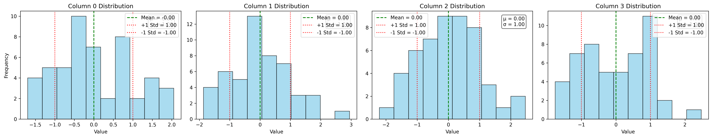
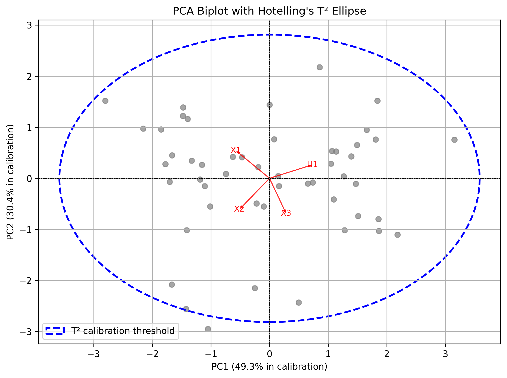
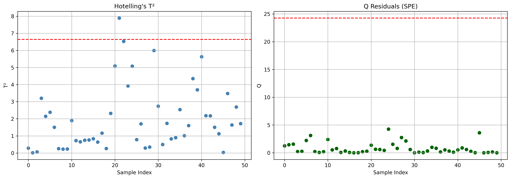
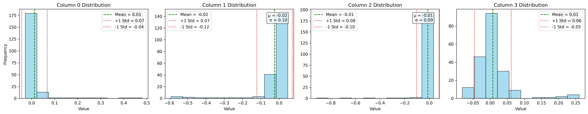
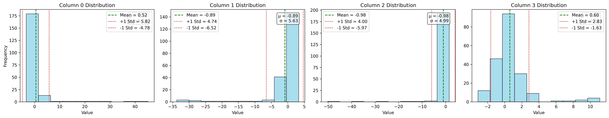
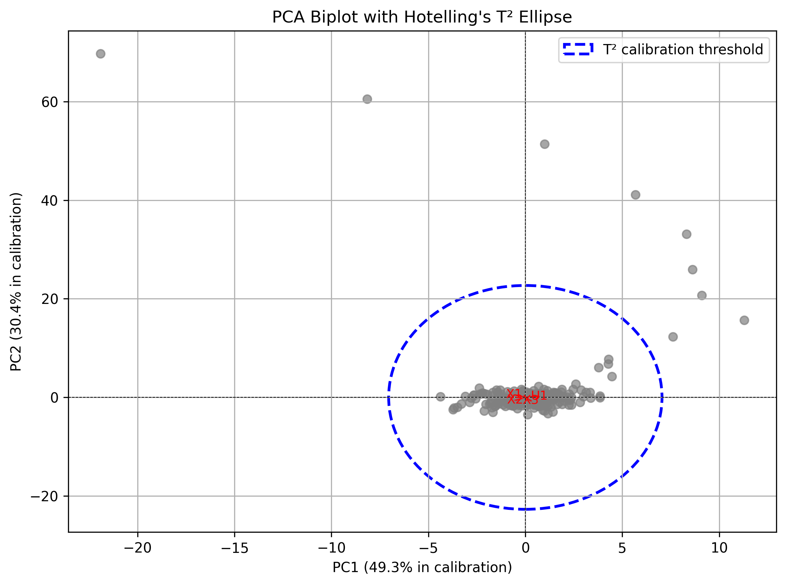
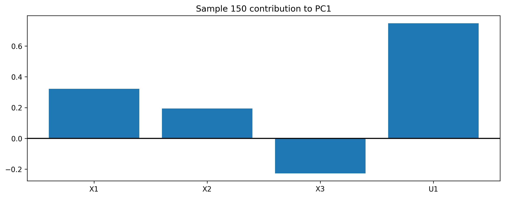
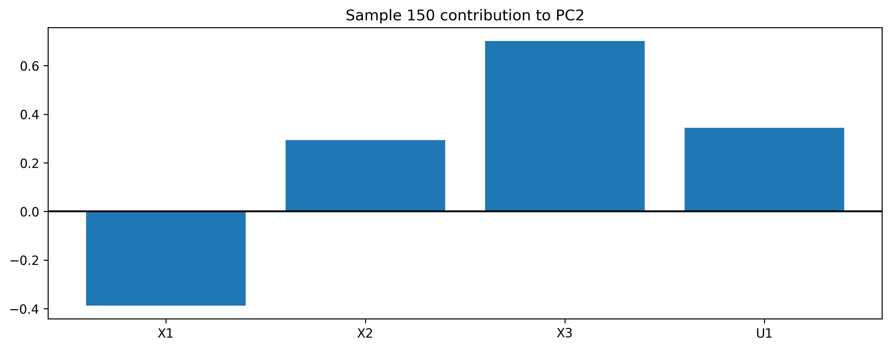

# 📊 MPC + PCA-Based Fault Detection and Process Monitoring

A simulation framework combining **Model Predictive Control (MPC)** with **Principal Component Analysis (PCA)-based statistical process monitoring** for fault detection and diagnosis in a multivariable dynamic system.

---

# 🚀 Overview

This project demonstrates a complete closed-loop system:

- Constrained Model Predictive Control (MPC)
- Quadratic Programming solved via Hildreth’s method
- Process disturbance + fault injection
- PCA-based multivariate monitoring
- Fault detection using T² and Q statistics
- Fault diagnosis via contribution plots

---

# 🧠 System Architecture

---

# 🎮 Model Predictive Control (MPC)

The system is controlled using a constrained MPC formulation:

- Linear state-space model
- Quadratic cost on states and inputs
- Box constraints on control inputs
- Optimization solved using QP

---

## 📈 MPC System Response

### States and control inputs over time

---

# ⚠️ Fault Injection

A fault is introduced into the system at time step **k = 150**:

- Gaussian noise is always present
- Additional bias simulates abnormal process behavior

---

# 📉 PCA-Based Process Monitoring

The combined dataset (states + inputs) is analyzed using PCA.

### Steps:
- Autoscaling (mean / variance normalization)
- Covariance matrix estimation
- Eigen decomposition
- Projection into principal component space

---

## 📊 Calibration Phase (Normal Operation)

### Before autoscaling

### After autoscaling

---

## 📉 PCA Model (Calibration Data)

### PCA Biplot (Calibration)

---

## 📊 Fault Detection Statistics (Calibration)

### Hotelling’s T² and Q (SPE)

---

# 🔍 Online Monitoring (New Data)

New process data is projected into the PCA model built from calibration data.

---

## 📉 Monitoring Data Distribution

### Before autoscaling

### After autoscaling

---

## 📊 PCA Monitoring Results

### PCA Biplot (Monitoring data)

---

### Hotelling’s T² and Q (Monitoring)

---

# 🔍 Fault Diagnosis (Contribution Analysis)

When a fault is detected, contribution plots identify responsible variables.

---

## 📊 Variable Contributions to Principal Components

### Sample 150 — PC1 Contribution

---

### Sample 150 — PC2 Contribution

---

# 📦 Project Structure
