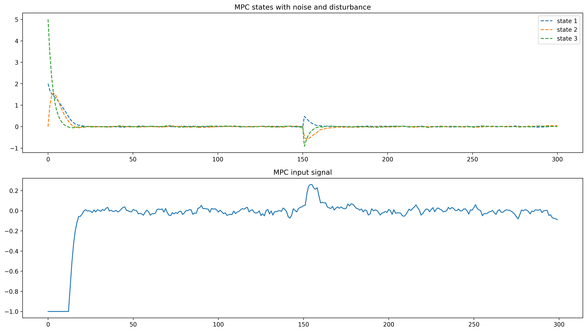
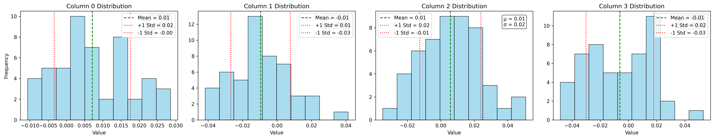
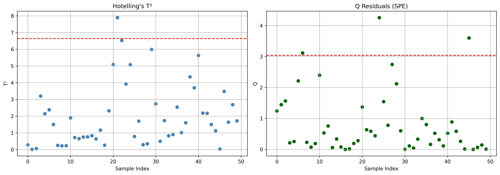
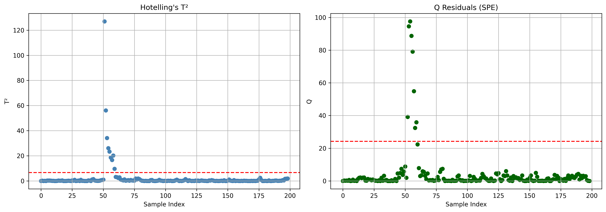
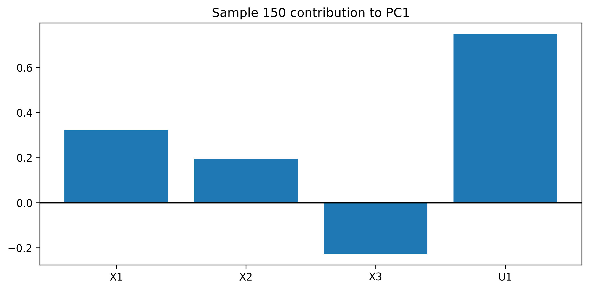
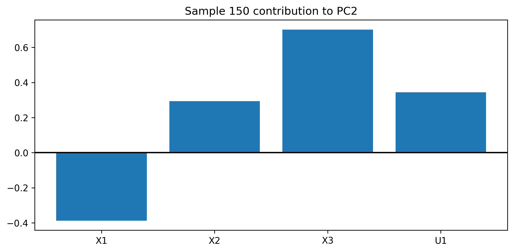
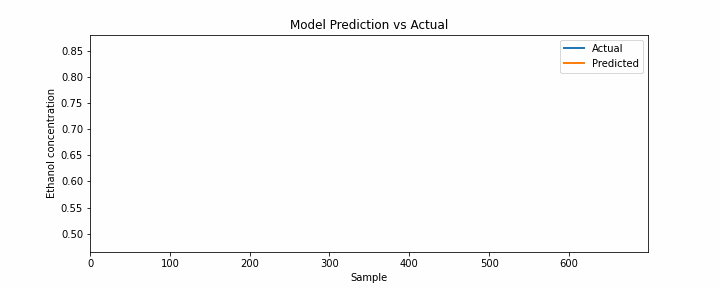
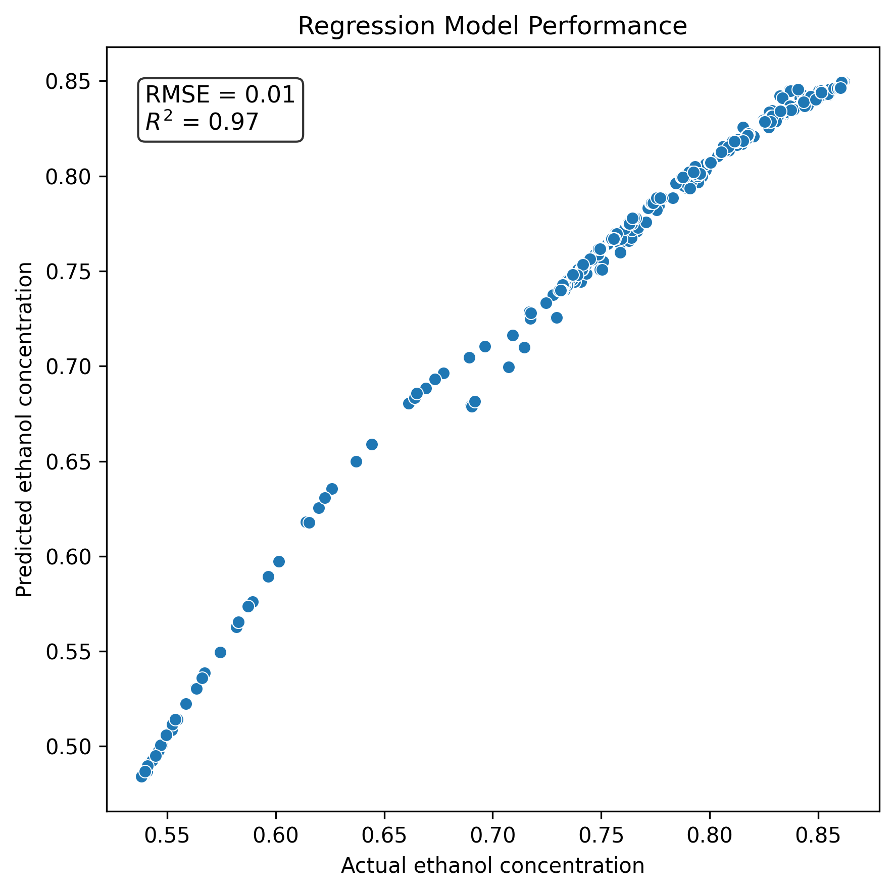

# MPC simulation framework with process monitoring
A simulation framework combining **Model Predictive Control (MPC)** with **Principal Component Analysis (PCA)-based statistical process monitoring** for fault detection and diagnosis in a multivariable dynamic system. Additional examples of **Infinite-Horizon Robust Model Predictive Control** and **Partial Least Squares Regression (PLSR) Soft Sensor**. The controller and monitoring combination is best suited for fixed point operations where MPC steers the system to one steady-state which is treated as 'normal operating conditions' for which variance and covariance based multivariable calibration/monitoring/fault-detection methods namely PCA and PLS can be constructed.

---

## Overview
This project demonstrates a closed-loop system:
- Constrained Model Predictive Control (MPC)
- Kalman Filter and partial state observations
- Quadratic Programming solved via several QP algorithms
- Linear Matrix Inequality Infinite Horizon MPC formulation
- Process disturbance + fault injection
- PCA-based multivariate monitoring
  - Fault detection using T² and Q statistics
  - Fault diagnosis via contribution plots  
- PLSR-based Soft Sensor 

---

## Model Predictive Control (MPC)
- Linear state-space model:  
```math
x_{k+1} = A x_k + B u_k
```  
where 
```math
 A \in \mathbb{R}^{nxn}
```  
```math
 B \in \mathbb{R}^{nxm}
```  
```math
 x_{k} \in \mathbb{R}^{nx1}
```  
```math
 u_{k} \in \mathbb{R}^{mx1}
```  

- Quadratic cost on states and inputs:  
```math
J = \sum_{k=0}^{N}\left(x_k^\top Q x_k+u_k^\top R u_k\right)
```
where  
```math
Q \succeq 0,
\qquad
 ```
```math
R \succ 0,
\qquad
 ```  
are weighting matrices for states and control effort.  

- Box constraints (lower and upper bounds) on control inputs:  
```math
u_{lb} <= u_{k} <= u_{ub}  
```  
- Optimization solved using QP algorithms
- Lifted matrices dictated by prediction horizon

Lifted system matrices form when prediction horizon is set to N:

```math
X_k = A_{lifted} x_k + B_{lifted} U_k
```

```math
X_k =
\begin{bmatrix}
\hat{x}_{k|k} \\
\hat{x}_{k+1|k} \\
\vdots \\
\hat{x}_{k+N|k}
\end{bmatrix}
\in \mathcal{X}^{N+1} \subseteq \mathbb{R}^{n(N+1)},
\quad
```

```math
U_k =
\begin{bmatrix}
\hat{u}_{k|k} \\
\hat{u}_{k+1|k} \\
\vdots \\
\hat{u}_{k+N-1|k}
\end{bmatrix}
\in \mathcal{U}^{N} \subseteq \mathbb{R}^{mN}
```

```math
A_{lifted} =
\begin{bmatrix}
I \\
A \\
A^2 \\
\vdots \\
A^N
\end{bmatrix}
\in \mathbb{R}^{n(N+1)\times n}
```

```math
B_{lifted} =
\begin{bmatrix}
0 & 0 & \cdots & 0 \\
B & 0 & \cdots & 0 \\
AB & B & \cdots & 0 \\
\vdots & \vdots & \ddots & \vdots \\
A^{N-1}B & A^{N-2}B & \cdots & B
\end{bmatrix}
\in \mathbb{R}^{n(N+1)\times m(N+1)}
```

The Quadratic Programming problem is of form:

```math
U_k^* = \arg\min_{U_k}\; X_k^\top \tilde{Q} X_k + U_k^\top \tilde{R} U_k
```
subject to
```math
X_k = A_{lifted} x_k + B_{lifted} U_k
```

```math
U_k \in \mathcal{U}_{ad}(x_k)
```
with
```math
\tilde{Q} =
\begin{bmatrix}
Q &  &  \\
 & \ddots &  \\
 &  & Q_f
\end{bmatrix}
\in \mathbb{R}^{n(N+1)\times n(N+1)},
\qquad
\tilde{R} =
\begin{bmatrix}
R &  &  \\
 & \ddots &  \\
 &  & R
\end{bmatrix}
\in \mathbb{R}^{mN\times mN}  
```  

The QP problem can be reduced to the following form when $X_k$ is substituted to the cost function.  

```math
U_k^* =
\arg\min_{U_k}\;
U_k^\top(B_{lifted}^\top \tilde{Q}B_{lifted} + \tilde{R})U_k
+ 2x_k^\top A_{lifted}^\top B_{lifted} U_k
+ x_k^\top A_{lifted}^\top \tilde{Q}A_{lifted} x_k
```
subject to
```math
U_k \in \mathcal{U}_{ad}(x_k)
```

### Reference
Michael Fink (2021).  
Implementation of Linear Model Predictive Control — Tutorial.   
https://arxiv.org/abs/2109.11986  

---
---
---

## Robust Model Predictive Control (RMPC)
- Linear state-space model
- Quadratic cost on states and inputs
- Box constraints on control inputs
- Optimization solved using LMI

$$
x_{k+1}=Ax_k+Bu_k
$$

$$
u_k=Lx_k
$$

$$
J =
\sum_{k=0}^{\infty}
\left(
x_k^\top Q x_k
+
u_k^\top R u_k
\right)
$$

$$
Q \succeq 0,
\qquad
R \succ 0
$$

$$
Y = LQ_U
$$  

The LMI formulation of the problem:  

$$
\min_{Q_U,Y,X_U,\gamma}
\gamma
$$

subject to

$$
\begin{bmatrix}
1 & x_k^\top \\
x_k & Q_U
\end{bmatrix}
\succeq 0
$$

$$
\begin{bmatrix}
X_U & Y \\
Y^\top & Q_U
\end{bmatrix}
\succeq 0
$$

$$
\begin{bmatrix}
Q_U
&
Q_UA^\top + Y^\top B^\top
&
Q_UQ^{1/2}
&
Y^\top R^{1/2}
\\
AQ_U + BY
&
Q_U
&
0
&
0
\\
Q^{1/2}Q_U
&
0
&
\gamma I
&
0
\\
R^{1/2}Y
&
0
&
0
&
\gamma I
\end{bmatrix}
\succeq
0
$$  

Where the box constraint:  

$$
|u_{k,j}| \le u_{j,\max}
$$

is implemented as  

$$
(X_U)_{jj} \le u_{j,\max}^2
$$  

The feedback gain is recovered from  

$$
L = YQ_U^{-1}
$$

RMPC control input:  

$$
u_k=Lx_k
$$


### Reference
Kothare, M. V., Balakrishnan, V., & Morari, M. (1996).  
**Robust constrained model predictive control using linear matrix inequalities**.  
*Automatica*, 32(10), 1361–1379.  
DOI: 10.1016/0005-1098(96)00063-5

---
---
---

## Kalman Filter
Process model:
```math
x_k = A x_{k-1} + B u_{k-1} + w_{k-1}
```
Measurement model:
```math
y_k = C x_k + v_k
```

Where:
$x_k$: state vector  
$u_k$: control input  
$y_k$: measurement  
$A$: state transition matrix  
$B$: control input matrix  
$C$: observation matrix  
$w_k$ ~ N(0, $Q$): process noise  
$v_k$ ~ N(0, $R$): measurement noise  

### 2. Initialization

- $\hat{x}_{0}$: initial state estimate  
- $P_0$: initial covariance  

### 3. Prediction Step (Time Update)

#### State prediction
```math
\hat{x}_{k}^{-} = A \hat{x}_{k-1} + B u_{k-1}
```
#### Covariance prediction
```math
P_{k}^{-} = A P_{k-1} A^{T} + Q
```
### 4. Update Step (Measurement Update)

#### Innovation (residual)
```math
y_{k,res} = y_{k} - C \hat{x}_{k}^{-}
```
#### Innovation covariance
```math
S_{k} = C P_{k}^{-} C^{T} + R
```
#### Kalman Gain
```math
K_{k} = P_{k}^{-} C^{T} S_{k}^{-1}
```
#### State update
```math
\hat{x}_{k} = \hat{x}_{k}^{-} + K_{k} y_{k,res}
```
#### Covariance update
```math
P_{k} = (I - K_{k} C) P_{k}^{-}
```
---

### 5. Summary (Compact Form)

Predict:
```math
\hat{x}_{k}^{-} = A \hat{x}_{k-1} + B u_{k-1}
```
```math
P_{k}^{-} = A P_{k-1} A^{T} + Q  
```
Update:
```math
K_{k} = P_{k}^{-} C^{T} S_{k}^{-1}
```
```math
\hat{x}_{k} = \hat{x}_{k}^{-} + K_{k} y_{k,res}
```
```math
P_{k} = (I - K_{k} C) P_{k}^{-}  
```

### Reference
Särkkä, S., & Svensson, L. (2023).  
*Bayesian Filtering and Smoothing* (2nd ed.).  
Cambridge: Cambridge University Press.  

---
---
---
## PCA

PCA relation (X auto-scaled):  
```math
X = TP^{T} +E
```
In rank-1 terms we solve the scores T and loadings P separately and deflate X either to the full column space or just to get e.g. the first two principal components.

```math
X=tp^{T}
```  
```math
t=Xp
```  
```math
var(t) = \frac{1}{n-1} t^{T}t \propto t^{T}t
```  
$\max_{p} var(t)$
subject to 
$p^{T}p=1$

$\max_{p} (Xp)^{T}(Xp)$
subject to
$p^{T}p=1$  

$\max_{p} p^{T}X^{T}Xp - \lambda(p^{T}p-1)$  

$X^{T}Xp - \lambda(p)=0$  
$(p^{T}p-1)=0$  

$X^{T}Xp = \lambda p$  
$p^{T}p = 1$  

This is an eigenvalue problem (EVP) for which there are multiple ways of solving it. After p (the loading) is solved, t (the scores) are available by definition t = Xp.

The remaining scores t and loadings p are calculated by repeating the optimization problem for deflated X.

The deflation step:
```math
X:=X-tp^{T}
```  

Suppose $k$ principal components are chosen, then the X is approximated as:  

```math
\hat{X} = T_{1:k}P_{1:k}^{T}
```  
The common ways of directly solving for all scores T and loadings P directly are SVD and Eigenvalue decomposition.  
SVD: $X = TP^{T}$ where $T = U\Sigma$ and $P = V$  


### Reference
Dunn, K. G. (2026).  
*Process Improvement using Data* (v2026.05.19).  
Zenodo.  
https://doi.org/10.5281/zenodo.20284935  

---
---
---
## PLSR

PLSR outer relations (X and Y auto-scaled):  
```math
X = TP^{T} +E
```
```math
Y = UQ^{T} +F
```
PLSR inner relation (we are interested in regression/prediction of Y variables):  
```math
U = TB +R
```  

In rank-1 terms, PLS is solved iteratively.  

```math
t=Xw
```
```math
u=Yc
```  
```math
cov(t,u) = \frac{1}{n-1} t^{T}u \propto t^{T}u
```  
$\max_{w,c} cov(t,u)$  
subject to  
$w^{T}w=1$  
$c^{T}c=1$  

$\max_{w,c} (w^{T}X^{T}Yc)$  
subject to  
$w^{T}w=1$  
$c^{T}c=1$  

$\max_{w,c} w^{T}X^{T}Yc - \lambda_{1}(w^{T}w-1) - \lambda_{2}(c^{T}c-1)$  

Differentiation w.r.t Lagrange multipliers:  
$w^{T}w-1=0$  
$c^{T}c-1=0$  

Differentiation w.r.t $w$:  
$X^{T}Yc-2\lambda_1w=0$  

Differentiation w.r.t $c$:  
$Y^{T}Xw-2\lambda_2c=0$  

By substituting $c=\frac{1}{2\lambda_2}Y^{T}Xw$ to $X^{T}Yc=2\lambda_1w$:  
$X^{T}YY^{T}Xw=2\lambda_1 2\lambda_2 w$  
and setting $\lambda = (2\lambda_1) (2\lambda_2)$ the equation becomes a regular EVP:  
$X^{T}YY^{T}Xw=\lambda w$  

For solving c, $w=\frac{1}{2\lambda_1}X^{T}Yc$ to $Y^{T}Xw=2\lambda_2c$:  
$Y^{T}XX^{T}Yc=(2\lambda_1) (2\lambda_2) c$  
$Y^{T}XX^{T}Yc=\lambda c$  

The solution to maximizing covariance is a matter of finding the solution to this set of equations (notice similarities with SVD on $X^{T}Y$):  
```math
X^{T}YY^{T}Xw=\lambda w  
```
```math
Y^{T}XX^{T}Yc=\lambda c  
```
```math
w^{T}w=1  
```
```math
c^{T}c=1  
```  

The scores $t$ and $u$ are readily solved by calculating $t = Xw$ and $u = Yc$.
The loadings for the outer PLSR relation are solved by ordinary least squares:  

```math
p = (X^{T}w)/(w^{T}w)
```  
```math
q = (Y^{T}c)/(c^{T}c)
```  

The inner relation is then calculated by ordinary least squares on the scores:  

```math
b = (u^{T}t)/(t^{T}t)
```  
After these steps we have $w$, $c$, $p$, $q$ and $b$. The next latent variables are calculated for the deflated matrices:  

```math
X:=X-tp^{T}
```  
```math
Y:=Y-uq^{T}
```  
or
```math
Y:=Y-tbq^{T}
```  

The PLSR model is usually calculated with NIPALS algorithm.  

The following matrix is useful for predicting purposes:  
```math
W^{*} = W(P^{T}W)^{-1}
```  
which is used for new measurement data (autoscaled with calibration means and standard deviations) followingly:  
```math
T = XW^{*}
```  
```math
U = TB
```  
```math
\hat{Y} = TBQ^{T} = XW^{*}BQ^{T}
```  
Which is still in autoscaled form and is brought back to original scale by:  
```math
\hat{Y}_{unscaled} = \hat{Y}diag(s_{Y}) + 1\mu_{Y}
```  

The autoscaling that is assumed for both PCA and PLSR can be expressed in the following way:

```math
Y = (Y_{unscaled} - 1\mu_{Y})diag(s_{Y})^{-1}
```  
```math
X = (X_{unscaled} - 1\mu_{X})diag(s_{X})^{-1}
```  
$\mu_{X}$: mean vector of calibration block $X$.  
$\mu_{Y}$: mean vector of calibration block $Y$.  
$s_{X}$: sample standard deviation vector of calibration block $X$.  
$s_{Y}$: sample standard deviation vector of calibration block $Y$.  

The PLSR predicting power is in first checking whether the scores T of new X data fall under threshold which gives confidence for predicting estimates.  

### Reference(s)
Rosipal, R., & Krämer, N. (2006)   
*Overview and Recent Advances in Partial Least Squares*.  
In C. Saunders et al. (Eds.), *Subspace, Latent Structure and Feature Selection* (LNCS 3940, pp. 34–51).  
Springer.  
https://www.ofai.at/~roman.rosipal/Papers/pls_book06.pdf

Geladi, P., & Kowalski, B. R. (1986)  
*Partial least-squares regression: A tutorial*  
*Analytica Chimica Acta*, *185*, 1–17.  
https://doi.org/10.1016/0003-2670(86)80028-9  

Wegelin, J. A. (2000)  
*A survey of partial least squares (PLS) methods, with emphasis on the two-block case* (Technical Report No. 371)  
Department of Statistics, University of Washington, Seattle  
Available at: https://stat.uw.edu/research/tech-reports/survey-partial-least-squares-pls-methods-emphasis-two-block-case  

Qin, S. J. (1993)  
*Partial least squares regression for recursive system identification*  
In *Proceedings of the 32nd IEEE Conference on Decision and Control* (pp. 2617–2621).  
IEEE.  
https://doi.org/10.1109/CDC.1993.325671  

---
---
---

# Plots of the MPC + PCA Monitoring example:
### States and control inputs over time


---
# Fault Injection
A fault is introduced into the system at time step **k = 150**:
- Gaussian noise at all times
- Additional bias simulates abnormal process behavior

---

# PCA-Based Process Monitoring
### Steps:
- Autoscaling (mean / variance normalization)
- Covariance matrix estimation
- Eigen decomposition
- Projection into principal component space

---

### Calibration Phase (Normal Operation)
### Before autoscaling


### After autoscaling


---

## PCA Model (Calibration Data)
### PCA Biplot (Calibration)


---

## Fault Detection Statistics (Calibration)

### Hotelling’s T² and Q (SPE)


---

## Online Monitoring (New Data)
New process data is projected into the PCA model built from calibration data.

---

## Monitoring Data Distribution

### Before autoscaling


### After autoscaling


---

## PCA Monitoring Results
### PCA Biplot (Monitoring data)


---

### Hotelling’s T² and Q (Monitoring)


---

## Fault Diagnosis (Contribution Analysis)

When a fault is detected, contribution plots identify responsible variables.

---

## Variable Contributions to Principal Components

### Sample 150 — PC1 Contribution


---

### Sample 150 — PC2 Contribution


---
---
---

# PLSR Soft Sensor:
### Predictions of ethanol concentration (distillation dataset)




